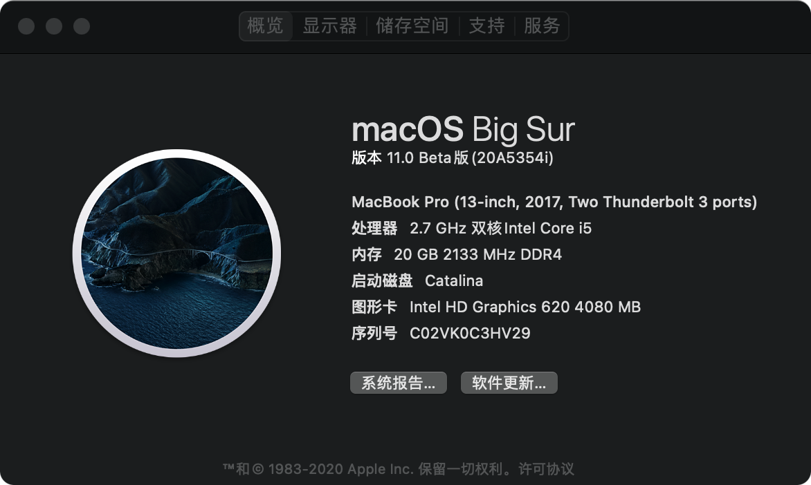
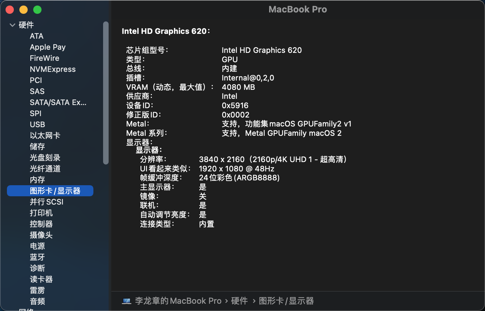

#  ASUS VIVOBOOK X410UV 黑苹果安装

|硬件项目|配置信息|
|:-----:|-----|
|处理器名称| DualCore Intel Core i5-7200U, 3100 MHz (31 x 100)|
|主板名称|ASUSTeK COMPUTER INC. X410UV|
|主板芯片组|Intel Sunrise Point-LP, Intel Kaby Lake-U|
|系统内存|20368 MB (DDR4 SDRAM)|
|BIOS 类型|AMI (04/17/2019)   X410UV.304|
|显示适配器|Intel(R) HD Graphics 620 (1 GB)|
|网络适配器|Broadcom 802.11ac Network Adapter (替换BCM94360CS2)|
|图形处理器(GPU)|[FAKE] nVIDIA GeForce 920MX (Asus)|
|显示器属性|BOE0720 (替换京东方4K显示器)|

     
     
  
  
1. BIOS设置 BIOS Settings 
* 更新bios版本至最新版 Update to latest BIOS version
* 设置DVMT 到64M Set DVMT to 64M
* 关闭安全启动 Disable Secure Boot
* 关闭 VT-d VT-d: I enabled it and macOS still runs fine. If you can't boot, try disabling it.

2. 创建USB启动盘 Create USB boot disk
* 下载MacOS 系统镜像，写入至U盘 Download MacOS system image and write it to USB flash disk  
* 在笔记本硬盘分区创建≥512M 的ESP分区，格式为FAT32，将EFI文件夹拷贝至该分区  
在笔记本硬盘分区创建≥512M 的ESP分区，格式为FAT32，将EFI文件夹拷贝至该分区
Create an ESP partition ≥ 512M in the notebook hard disk partition in the format of FAT32, and copy the EFI folder to the partition 
* 开机按F2，选择你创建的EFI分区选项进入即可开始安装，进去磁盘分区将你所需安装mac 的分区抹除为APFS格式，再进行下一步安装，详细安装过程可以  Google or baidu  Press F2, select the EFI partition option you created to start the installation. Enter the disk partition to erase the partition you need to install Mac to APFs format, and then proceed to the next installation. The detailed installation process is OK

3. 安装完成系统之后，运行GenSMBIOS.command 生成SN、UUID相关信息，使用opencore configurator 打开EFI/OC/config.plist ，在Platforminfo-datahub-generic-PlatforminfoNVRAM页面，填写下图选项框信息  After installing the system, run GenSMBIOS.command Generate Sn, UUID related information 
Using OpenCORE configurator to open EFI / OC/ config.plist On the platforminfo datahub generic platforminfo NVRAM page, fill in the following box information

     
  

